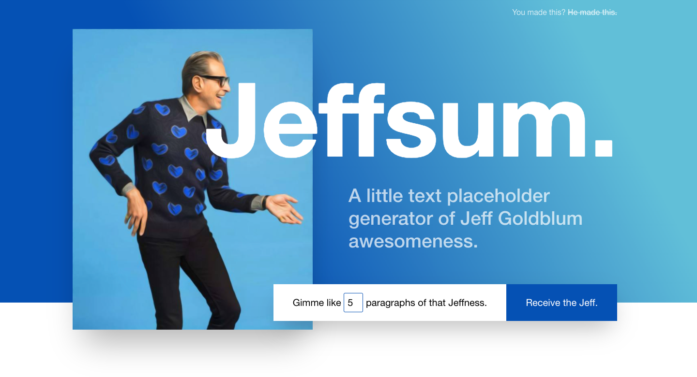

# A homage to Jeffsum

Demo: https://jeffsum.oliverturner.cloud

## Introduction

Recently the world was introduced to the glory that is
[jeffsum.com](http://jeffsum.com). Intrigued by its gorgeous fading gradients I
peeked beneath the covers to see how this effect had been achieved, and found
that GSAP was being used to fade between layered divs with linear gradient
backgrounds. Solid, cross-browser compatible stuff!

...But a small insistent voice within asked: "why can't we do this more
declaratively?"

## Houdini: CSS **and** JS

CSS seems to have become a battleground of late, tempers flaring over whether JS
has any business being "in" CSS... but the reality is that the two languages are
becoming _increasingly_ complementary.
[Houdini](https://wiki.mozilla.org/CSS/Houdini) makes this partnership explicit,
with lower level APIs being exposed for developers to extend highlevel CSS
authoring features.

The combination of

- [Web Animations API](https://developer.mozilla.org/en-US/docs/Web/API/Web_Animations_API)
- [CSS Properties & Values API](https://www.w3.org/TR/css-properties-values-api-1/)
- [Typed OM](https://developers.google.com/web/updates/2018/03/cssom)

finally lets us achieve what many of us have long awaited: _declaratively
animating gradients either by class name or dynamically_.
